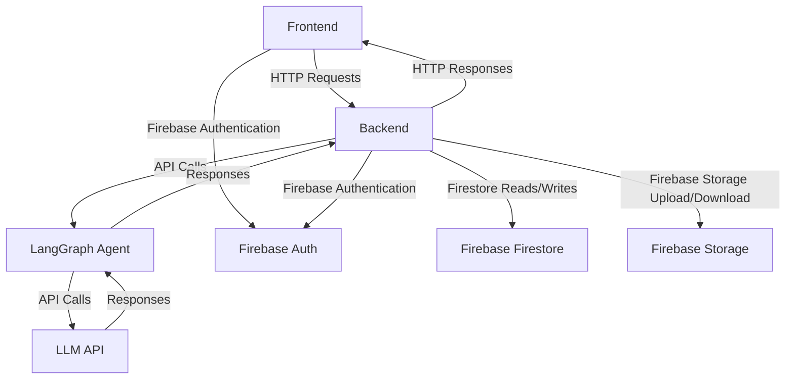

# Adovate - Ad Performance Agent
Adovate is a comprehensive tool designed to analyze and optimize ad campaigns. It leverages advanced machine learning models and data analysis techniques to provide insights into the performance of various keywords used in ad campaigns. The tool helps marketers identify high-performing keywords, understand the reasons behind their success, and make data-driven decisions to improve the overall effectiveness of their ad campaigns. By analyzing key metrics such as ROAS, ACOS, CTR, and conversion rates, Ad Performance Agent provides actionable recommendations to enhance ad performance and maximize return on investment.

LIVE DEMO: [Adovate - Ad Performance Agent](https://adovate-app.onrender.com/)
P.S: The app is running on a free stage of render, so it may take a few seconds to load initially as the services are spun down after some inactivity.

## Project Overview
This project offers a full-stack ad performance analysis solution built with a Next.js frontend, an Express backend, and a specialized LangGraph agent for intelligent insights. It allows users to upload CSV-based advertising data, which is then processed on the backend and sent to a Language Learning Model (LLM) API for analysis. The LLM returns structured information about high-performing and low-performing keywords, along with suggestions for optimizing future ad campaigns. Companies, agencies, or marketers can quickly evaluate the effectiveness of multiple ad strategies, spotting inefficiencies and boosting ROI through data-driven insights. The system stores the uploaded files and analysis reports using Firebase services, facilitating easy retrieval of past analyses.

## Architecture Diagram



## Setup Instructions

1. **Clone the repository:**
    ```bash
    git clone https://github.com/yourusername/ad-performance-agent.git
    cd ad-performance-agent
    ```

2. **Install dependencies:**
    - **Frontend:**
        ```bash
        cd frontend
        npm install
        ```
    - **Backend:**
        ```bash
        cd backend
        npm install
        ```

3. **Set up environment variables:**
    - Create a `.env` file in the `backend` directory and add the following:
        ```
        OPENAI_API_KEY=your_openai_api_key
        FIREBASE_PROJECT_ID=your_firebase_project_id
        FIREBASE_PRIVATE_KEY=your_firebase_private_key
        FIREBASE_CLIENT_EMAIL=your_firebase_client_email
        ```
    - Get your service-account.json file from [Firebase](https://firebase.google.com/docs/admin/setup#initialize_the_sdk_in_non-google_environments) and put it in the `backend` directory.

    - Create a `.env` file in the `frontend` directory and add the following:
        ```
        NEXT_PUBLIC_FIREBASE_API_KEY=your_firebase_api_key
        NEXT_PUBLIC_FIREBASE_AUTH_DOMAIN=your_firebase_auth_domain
        NEXT_PUBLIC_FIREBASE_PROJECT_ID=your_firebase_project_id
        NEXT_PUBLIC_FIREBASE_STORAGE_BUCKET=your_firebase_storage_bucket
        NEXT_PUBLIC_FIREBASE_MESSAGING_SENDER_ID=your_firebase_messaging_sender_id
        NEXT_PUBLIC_FIREBASE_APP_ID=your_firebase_app_id
        ```

4. **Run the development servers:**
    - **Frontend:**
        ```bash
        cd frontend
        npm run dev
        ```
    - **Backend:**
        ```bash
        cd backend
        npm start
        ```

5. **Open the application:**
    - Navigate to `http://localhost:3000` in your browser to access the frontend.


## Docker Instructions

1. **Build and Run the Application using Docker Compose:**
    - Ensure you are in the root directory of the project where the `docker-compose.yml` file is located.
    - Run the following command to build and start the containers:
        ```bash
        docker-compose up --build
        ```

2. **Stop the Containers:**
    - To stop the running containers, use:
        ```bash
        docker-compose down
        ```

3. **Access the Application:**
    - Navigate to `http://localhost:3001` in your browser to access the frontend.
    - The backend will be running on `http://localhost:3000`.
    

## API Documentation

### `/upload` Endpoint

- **Method:** `POST`
- **Description:** Uploads ad data for analysis.
- **Request:**
    - **Headers:**
        ```json
        {
            "Content-Type": "multipart/form-data"
        }
        ```
    - **Body:**
        ```form-data
        {
            "file": "<file>"
        }
        ```
- **Response:**
    - **Success:**
        ```json
        {
            "message": "File uploaded successfully",
            "fileId": "unique_file_id"
        }
        ```
    - **Error:**
        ```json
        {
            "error": "Error message"
        }
        ```

### `/analyze` Endpoint

- **Method:** `POST`
- **Description:** Analyzes the uploaded ad data.
- **Request:**
    - **Headers:**
        ```json
        {
            "Content-Type": "application/json"
        }
        ```
    - **Body:**
        ```json
        {
            "fileId": "unique_file_id"
        }
        ```
- **Response:**
    - **Success:**
        ```json
        {
            "summary": "Analysis summary",
            "highPerformingKeywords": [
                {
                    "keyword": "example_keyword",
                    "performance": "high",
                    "impressions": 1000,
                    "clicks": 100,
                    "conversions": 10
                }
            ],
            "lowPerformingKeywords": [
                {
                    "keyword": "example_keyword",
                    "performance": "low",
                    "impressions": 500,
                    "clicks": 20,
                    "conversions": 1
                }
            ],
            "suggestions": "Improvement suggestions"
        }
        ```
    - **Error:**
        ```json
        {
            "error": "Error message"
        }
        ```

### `/reports` Endpoint

- **Method:** `GET`
- **Description:** Retrieves all analysis reports.
- **Request:**
    - **Headers:**
        ```json
        {
            "Authorization": "Bearer <token>"
        }
        ```
- **Response:**
    - **Success:**
        ```json
        {
            "reports": [
                {
                    "reportId": "unique_report_id",
                    "summary": "Analysis summary",
                    "createdAt": "timestamp"
                }
            ]
        }
        ```
    - **Error:**
        ```json
        {
            "error": "Error message"
        }
        ```

### `/reports/recent` Endpoint

- **Method:** `GET`
- **Description:** Retrieves the most recent analysis reports.
- **Request:**
    - **Headers:**
        ```json
        {
            "Authorization": "Bearer <token>"
        }
        ```
- **Response:**
    - **Success:**
        ```json
        {
            "reports": [
                {
                    "reportId": "unique_report_id",
                    "summary": "Analysis summary",
                    "createdAt": "timestamp"
                }
            ]
        }
        ```
    - **Error:**
        ```json
        {
            "error": "Error message"
        }
        ```

### `/reports/:reportId` Endpoint

- **Method:** `GET`
- **Description:** Retrieves a specific analysis report by its ID.
- **Request:**
    - **Headers:**
        ```json
        {
            "Authorization": "Bearer <token>"
        }
        ```
    - **Params:**
        ```json
        {
            "reportId": "unique_report_id"
        }
        ```
- **Response:**
    - **Success:**
        ```json
        {
            "report": {
                "reportId": "unique_report_id",
                "summary": "Analysis summary",
                "details": "Detailed analysis",
                "createdAt": "timestamp"
            }
        }
        ```
    - **Error:**
        ```json
        {
            "error": "Error message"
        }
        ```

        ## Data Schema

        ### Ad Data CSV Structure

        The CSV file uploaded for analysis should follow this structure:

        | Column Name       | Data Type | Description                                      |
        |-------------------|-----------|--------------------------------------------------|
        | `Matched product `| String    | Matched product in the ad                        |
        | `Product targets` | String    | Product targets for the ad                       |
        | `Added As`        | String    | How the product was added                        |
        | `Impressions`     | Integer   | Number of times the ad was shown                 |
        | `Clicks`          | Integer   | Number of times the ad was clicked               |
        | `CTR`             | Float     | Click-through rate of the ad                     |
        | `Spend(USD)`      | Float     | Total spend in USD for the ad                    |
        | `CPC(USD)`        | Float     | Cost per click in USD                            |
        | `Orders`          | Integer   | Number of orders resulting from the ad           |
        | `Sales(USD)`      | Float     | Sales in USD generated from the ad               |
        | `ACOS`            | Float     | Advertising cost of sales                        |
        | `ROAS`            | Float     | Return on ad spend                               |
        | `Conversion rate` | Float     | Conversion rate of the ad                        |

        ### Analysis Report Structure

        The analysis report generated by the system will have the following structure:

        ```json
        {
            "reportId": "unique_report_id",
            "analysisTimestamp": {
                "_seconds": 100000000
            },
            "uploadTimestamp": {
                "_seconds": 100000000
            },
            "filePath": "path_to_uploaded_file",
            "analysisResult":{
                "summary": "Analysis summary",
                "highPerformingKeywords": [
                    {
                        "keyword": "example_keyword",
                        "performance": "high",
                        "impressions": 1000,
                        "clicks": 100,
                        "conversions": 10,
                        "cost": 50.0,
                        "revenue": 500.0
                    }
                ],
                "lowPerformingKeywords": [
                    {
                        "keyword": "example_keyword",
                        "performance": "low",
                        "impressions": 500,
                        "clicks": 20,
                        "conversions": 1,
                        "cost": 25.0,
                        "revenue": 50.0
                    }
                ],
                "suggestions": "Improvement suggestions",
            }
        }
        ```

## Assumptions

- The target audience for the ad analysis tool includes digital marketers and advertising professionals.
- The ad data files are in CSV format and follow a specific structure expected by the analysis algorithm.
- The system handles relatively small CSV files (few MB).
- The analysis focuses on key performance metrics such as ROAS, ACOS, CTR, and conversion rates.
- Users visit the website only on desktop devices for now.

## Future Improvements


1. **Real-time Analysis**:  
   Implement real-time ad data analysis, allowing marketers to instantly react to performance changes and optimize campaigns on the fly with real-time dashboards and alerts.

2. **Integration with Ad Platforms**:  
   Integrate with popular ad platforms (Google Ads, Facebook Ads) to pull data directly, automating data collection and streamlining the process.

3. **Custom Reports**:  
   Allow users to generate custom reports based on specific criteria and KPIs, providing more tailored insights for different campaigns and clients.

4. **Advanced Visualization**:  
   Add interactive data visualizations like charts, graphs, and heatmaps for deeper insights into campaign performance, making it easier to spot trends and optimize strategies.

5. **Mobile Responsiveness**:  
   Optimize the platform for mobile devices, enabling marketers to monitor campaigns and receive push notifications on the go.

6. **Custom Templates**:  
   Introduce pre-defined upload templates for different ad platforms to streamline the CSV upload process, ensuring correct data formatting.

7. **Agentic Workflow for Automated Optimization**:  
   Implement AI-driven agents to automatically optimize ad campaigns based on performance insights, adjusting bids, pausing underperforming ads, and adjusting budgets.

8. **Collaboration Features**:  
   Enable team collaboration features like shared reports, task assignments, and real-time updates to improve workflow within marketing teams.

9. **Data Comparison**:  
    Allow users to compare campaign performances with historical data or other campaigns to identify trends and areas for improvement in reference to some benchmark.
